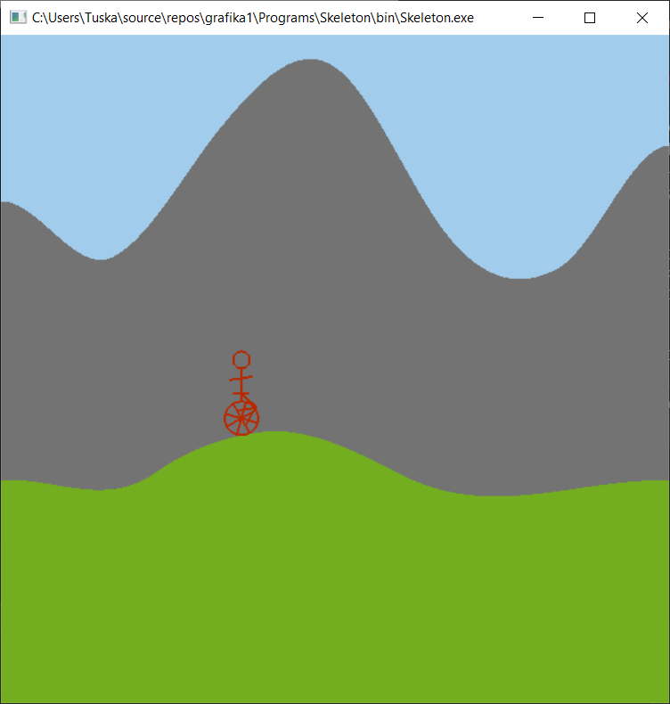

# Grafika 1. házi feladat

## Feladatleírás

Írjon 2D egykerekű bicikli szimulátor programot. A pálya negatív tenziójú explicit(!) Kochanek-Bartels spline, amelynek kontrollpontjait az egér bal gombjának lenyomásával lehet megadni, tetszőleges időpontban és sorrendben. A bicikli vonalas ábra, forgó, többküllős kerékkel és vadul pedálózó biciklissel. A kamera ortogonális vetítéssel dolgozik, kezdetben rögzített, majd SPACE hatására a biciklizőt követi. A biciklis a kezdeti kamera két széle között teker fel és alá, amit kb. 5 másodperc alatt tesz meg. A biciklis állandó erővel teker, amivel a nehézségi erőt és a sebességgel arányos légellenállást küzdi le. A tömeg az izmok erejéhez képest elhanyagolható, így a sebesség gyorsan változhat. A távoli háttér egy procedurálisan textúrázott téglalap, ami az égboltot és pozitív tenziójú explicit(!) Kochanek-Bartels spline-nal definiált hegységet ábrázol. A távoli háttér nem követi a kamerát a hamis perspektíva érdekében. Extrák: Az út mellett tereptárgyak helyezhetők el. A biciklis orientációja fizikailag helyesen úgy változik, hogy a forgatónyomaték zérus legyen.

Screenshot:

